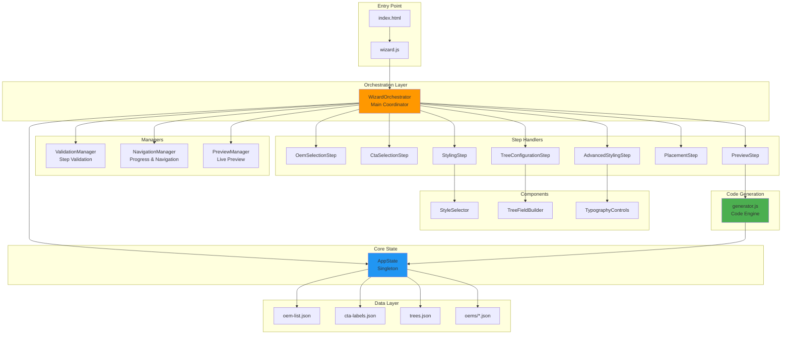
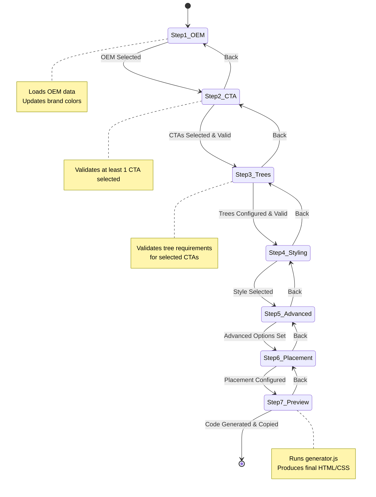
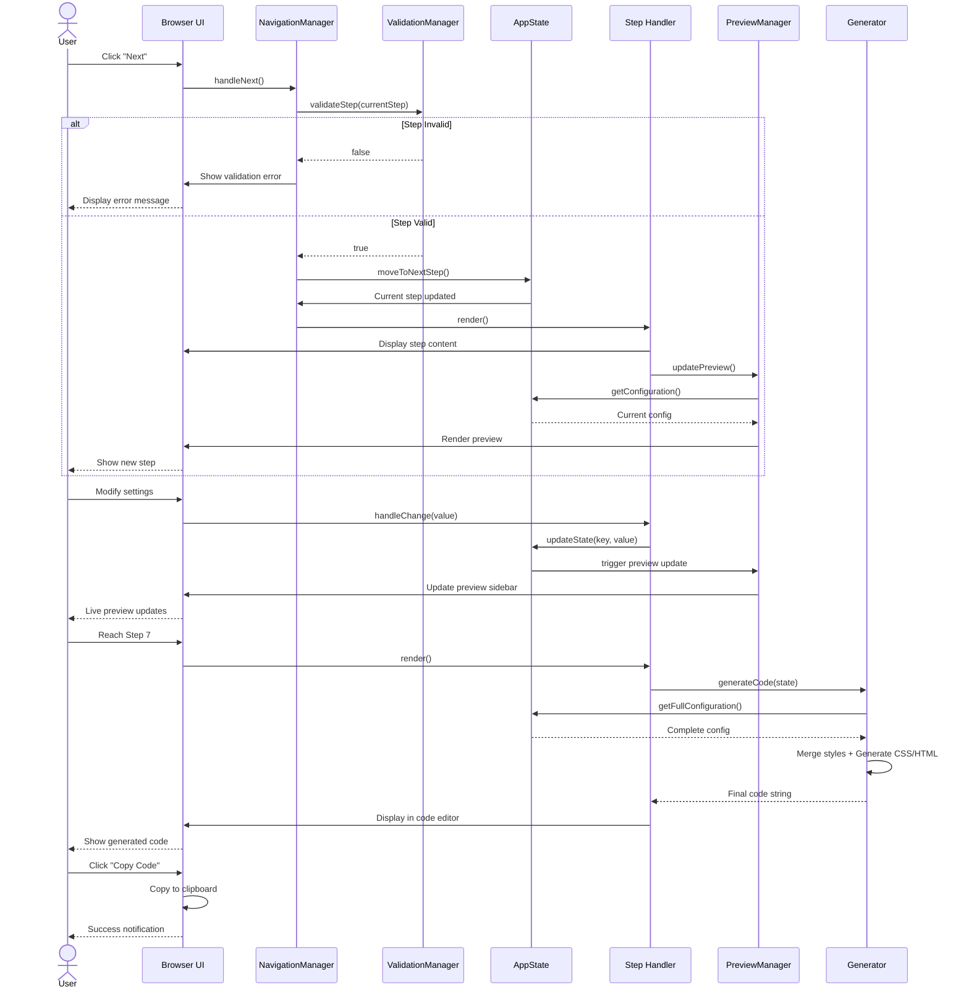
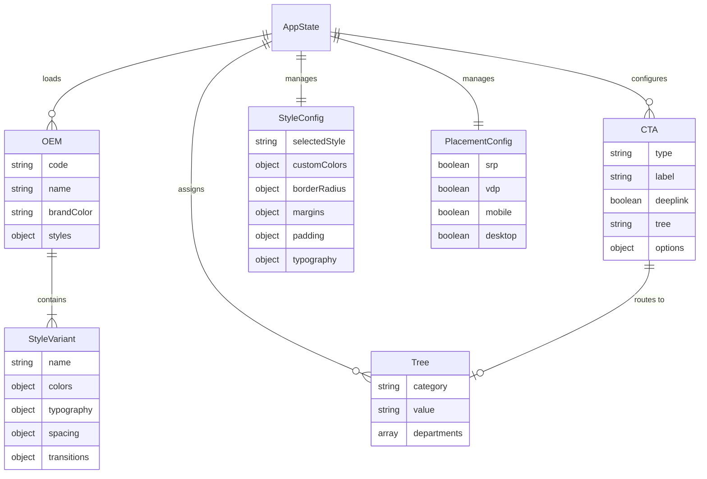

# CTA Builder

A front-end wizard tool for generating custom Call-to-Action (CTA) code for automotive dealership websites.

## Features

- 38+ OEM brand support with pre-configured styling
- 7-step wizard interface
- Support for multiple CTA types:
  - Personalize My Payment (BuyNow)
  - Confirm Availability
  - Value My Trade
  - Schedule Test Drive
  - Pre-Qualify
  - Get E-Price
  - Text Us
  - Chat Now
- Deeplink support for enhanced functionality
- Live preview sidebar with real-time updates
- OEM color scheme preview updates dynamically on Step 1
- Advanced styling controls (border-radius, margins, padding)
- Copy-to-clipboard code generation
- SRP/VDP/Mobile/Desktop placement configuration

## Getting Started

### Prerequisites

- Modern web browser (Chrome recommended)
- Local web server (Python, Node.js, or any HTTP server)

### Running the Application

1. Start a local web server in the project directory:

   **Using Python:**
   ```bash
   python -m http.server 8000
   ```

   **Using Node.js:**
   ```bash
   npx http-server -p 8000
   ```

2. Open your browser and navigate to:
   ```
   http://localhost:8000
   ```

3. Follow the 7-step wizard:
   - **Step 1:** Select your OEM brand (live preview updates with brand colors)
   - **Step 2:** Choose which CTAs to include
   - **Step 3:** Configure trees and departments (with deeplink support)
   - **Step 4:** Customize styling and labels
   - **Step 5:** Advanced styling (border-radius, margins, padding)
   - **Step 6:** Set placement (SRP/VDP/Mobile/Desktop)
   - **Step 7:** Preview and copy generated code

## Project Structure

```
cta_builder/
├── index.html                          # Main HTML entry point
├── styles/
│   └── wizard.css                      # All application styling
├── src/                                # Core application logic
│   ├── state.js                        # State management singleton
│   ├── utils.js                        # DOM/utility helper functions
│   ├── wizard.js                       # Module entry point
│   ├── generator.js                    # Code generation engine
│   └── wizard/
│       ├── WizardOrchestrator.js       # Main orchestrator
│       ├── ValidationManager.js        # Step validation logic
│       ├── NavigationManager.js        # Navigation & progress bar
│       ├── PreviewManager.js           # Live preview rendering
│       ├── components/
│       │   ├── StyleSelector.js        # Style selection UI
│       │   ├── TreeFieldBuilder.js     # Tree/department configuration UI
│       │   └── TypographyControls.js   # Advanced styling controls
│       └── steps/                      # 7-step wizard implementations
│           ├── OemSelectionStep.js     # Step 1: OEM selection
│           ├── CtaSelectionStep.js     # Step 2: CTA selection
│           ├── TreeConfigurationStep.js # Step 3: Tree configuration
│           ├── StylingStep.js          # Step 4: Styling
│           ├── AdvancedStylingStep.js  # Step 5: Advanced styling
│           ├── PlacementStep.js        # Step 6: Placement
│           └── PreviewStep.js          # Step 7: Preview & code
└── data/                               # Configuration data
    ├── oem-list.json                   # 38+ OEM brands
    ├── cta-labels.json                 # CTA configurations
    ├── trees.json                      # Tree/department routing data
    └── oems/                           # Individual OEM style files
        ├── toyota.json, honda.json, etc. (40 files total)
```

## Architecture & Diagrams

### System Architecture

The application follows a **Manager-Step pattern** with clear separation of concerns:



### Data Flow

This diagram shows how user input flows through the system to generate the final code:

```mermaid
flowchart TD
    Start([User Opens Wizard]) --> LoadData[Load JSON Data<br/>OEMs, CTAs, Trees, Styles]
    LoadData --> InitState[Initialize AppState]
    InitState --> Step1{Step 1:<br/>Select OEM}

    Step1 --> |OEM Selected| UpdatePreview1[Update Brand Colors<br/>in Preview]
    UpdatePreview1 --> Step2{Step 2:<br/>Select CTAs}

    Step2 --> |CTAs Chosen| Validate2{Validation<br/>Manager}
    Validate2 --> |Valid| Step3{Step 3:<br/>Configure Trees}
    Validate2 --> |Invalid| Error2[Show Error]
    Error2 --> Step2

    Step3 --> |Trees Configured| Validate3{Validation<br/>Manager}
    Validate3 --> |Valid| Step4{Step 4:<br/>Select Style}
    Validate3 --> |Invalid| Error3[Show Error]
    Error3 --> Step3

    Step4 --> |Style Selected| UpdatePreview4[Update Preview<br/>with Style]
    UpdatePreview4 --> Step5{Step 5:<br/>Advanced Styling}

    Step5 --> |Customizations| UpdatePreview5[Update Preview<br/>with Custom Styles]
    UpdatePreview5 --> Step6{Step 6:<br/>Set Placement}

    Step6 --> |Placement Set| Step7{Step 7:<br/>Preview & Generate}

    Step7 --> MergeData[Merge OEM Styles<br/>+ User Customizations]
    MergeData --> GenerateCSS[Generate CSS Code]
    GenerateCSS --> GenerateHTML[Generate HTML Markup]
    GenerateHTML --> DisplayCode[Display in Code Editor]
    DisplayCode --> Copy[User Copies Code]
    Copy --> End([Complete])

    style Step1 fill:#e3f2fd
    style Step2 fill:#e3f2fd
    style Step3 fill:#e3f2fd
    style Step4 fill:#e3f2fd
    style Step5 fill:#e3f2fd
    style Step6 fill:#e3f2fd
    style Step7 fill:#e3f2fd
    style GenerateCSS fill:#c8e6c9
    style GenerateHTML fill:#c8e6c9
```



### State Management Flow



### Component Interaction Sequence

This shows the typical interaction flow when a user navigates through the wizard:



### Data Model Structure



## Technical Details

- **Framework:** Vanilla JavaScript ES6 modules
- **Architecture Pattern:** Manager-Step with singleton state management
- **Styling:** Custom CSS with OEM-specific branding
- **Data:** JSON-based configuration files
- **Browser Support:** Modern browsers with ES6 module support

## Output

The wizard generates copy-paste ready HTML/CSS code including:
- Complete CSS styles with OEM-specific branding
- HTML markup with proper class names
- SRP/VDP/Mobile/Desktop wrapper divs
- Appropriate onclick handlers or data attributes
- Deeplink configuration (when enabled)
- Custom border-radius, margins, and padding

## Notes

- All generated code is production-ready
- Supports both regular CTAs and deeplinked variants
- Includes hover states and transitions
- Live preview updates in real-time as you configure
- OEM color scheme applies to preview immediately upon selection
- Trees sorted alphabetically for easy selection
- Department defaults auto-selected (can be changed)
